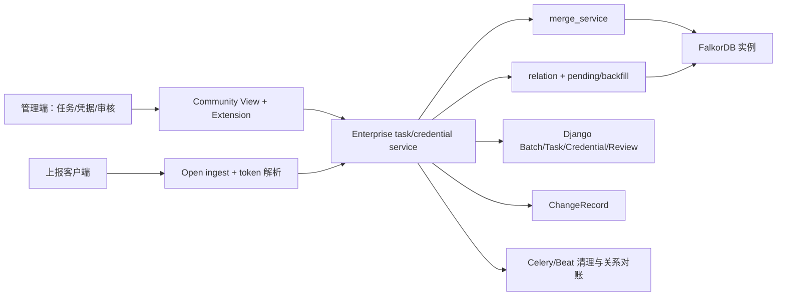

# CMDB 自定义上报架构与代码质量审计

## 审计结论

模块已经形成“控制面任务/凭据 + 数据面 ingest + merge + relation/pending + cleanup/review”
的可理解分层，standard 与 quick 共用后半段写入管线，扩展入口也避免社区层直接依赖
Enterprise 实现。这些结构使两种模式的真实正向流程能够复用同一套验证和清理合同。

但当前还不是可发布的生产级边界：授权、身份/保留字段、owner 隔离、跨存储一致性、错误
协议与资源预算均有已复现缺口。最危险的共同模式是“先产生不可回滚副作用，后更新状态或
发送消息”，以及“用 model_id 或 caller 提供的 `_id` 代替 task/team 所有权证明”。

## 端到端结构

关键一致性域有三个：Django 数据库、FalkorDB 和 Celery broker。当前请求没有一个持久化
operation/outbox 把三者串成可恢复状态机，因此数据库事务不能回滚图写或已发送消息。

## 质量维度评分

| 维度 | 评分 | 证据与判断 |
| --- | --- | --- |
| 模块边界 | 3/5 | Community Extension 隔离清楚；View/Service 基本分层，但错误、授权和调用者上下文仍散落 |
| 正确性 | 2/5 | 两种模式正向 E2E 可运行；CRV-F03—F10、F15—F16 证明多项非法输入/部分失败语义错误 |
| 安全与租户隔离 | 1/5 | CRV-F01、F02、F08、F09、F14 涉及组织越权或认证主体合同 |
| 一致性与恢复 | 2/5 | Batch 和 ledger 提供局部可观测性；图/DB/消息仍存在不可原子窗口（F10、F13） |
| 可扩展性 | 2/5 | service 可替换；入口、图扫描、pending 和凭据查询缺统一预算（F12） |
| 可测试性 | 4/5 | 依赖点可注入/patch，已构建严格 xfail、故障注入及真实 E2E；生产代码原有测试遗漏跨边界合同 |
| 可运维性 | 2/5 | Batch/ChangeRecord 可追踪；错误 500、Beat 未注册、缺 operation/outbox 和续跑游标降低可恢复性 |
| 代码清晰度 | 3/5 | 命名与 service 职责总体清楚；隐式 dict schema、字符串异常识别和动态 user 属性增加脆弱性 |

## 具体架构与质量 Finding

| ID | 严重度 | 位置 | 问题 | 建议 |
| --- | --- | --- | --- | --- |
| AQ-01 | Critical | `merge_service.py:72-101`；`cleanup_service.py` | old_data 仅按 model_id 全量读取，snapshot/expire 缺 task/team owner 边界 | 所有图实体持久化 owner/task/team；查询和删除以 owner scope 为强制条件 |
| AQ-02 | Critical | `relation_service.py:18-21,52-66,86-100` | target 只按 model+identity，source 可直接信任 caller `_id` | 统一 `OwnedInstanceRef` 解析，校验模型、task、team 和 association 两端 |
| AQ-03 | High | `ingest_service.py:63-127` | Batch、图写、审计、关系与时间戳不是一个可恢复状态机 | 引入 operation/outbox，按 generation/CAS 推进，重试先核对事实 |
| AQ-04 | High | `auto_relation_reconcile.py:43-49` | 同步 `send_task` 失败把已图写请求变成 500 | DB outbox + `on_commit` 投递；投递失败可重试而不回滚业务事实 |
| AQ-05 | High | `cleanup_service.py:141-151` | 先删图后保存 approved，DB 故障造成状态与事实分叉 | 先持久化 deleting lease/operation，再幂等删图，最后 CAS 完成 |
| AQ-06 | High | `ingest_service.py:60-61` | payload 基数无上限，空/错类型用 `or []` 淡化协议错误 | Serializer 强类型和明确条数/字节预算，超限零副作用 |
| AQ-07 | High | `merge_service.py:146-154` | 相同 identity 的批次项可在 dict index 中后写覆盖，缺重复拒绝 | merge 前建立唯一签名并拒绝批内重复；错误定位到具体 item |
| AQ-08 | High | `relation_service.py:94-100,120-136` | pending 无去重/租约/分页，一条 poison 关系可反复扫描并阻断后续 | 唯一指纹、状态/重试次数、游标 chunk、单条隔离与 dead-letter |
| AQ-09 | High | `custom_reporting.py:79-89` | open ingest 自行解析认证，却没有稳定错误 envelope | 独立 DRF authentication class + 统一 401/403 和安全审计 |
| AQ-10 | High | `core/backends.py:66-78`；`cmdb/views/instance.py:70-82` | `group_list` 在认证方式间形态不同 | 不动态改写 User；建立强类型 `CallerContext`/`AuthorizedOrgScope` |
| AQ-11 | High | `model_service.py:26-89` | identity/quick schema 是松散 dict；空 identity 和保留字段可晚失败 | 单一 schema 编译阶段验证 identity、字段类型、保留字段和模型存在性 |
| AQ-12 | High | 模型关联创建与 `check_asso_mapping` | 配置入口不保证执行入口所需 mapping invariant | 共享 association serializer/domain validator；存量启动巡检 |
| AQ-13 | Medium | `ingest_service.py:30-34` | 每个请求线性扫描全部启用凭据并逐项 hash 匹配 | 存储不可逆 token lookup key/index；恒定时间校验实际 secret |
| AQ-14 | Medium | `activity_service.py:104-147` | batch/review 在切片前全量物化 | 数据库分页、聚合查询和固定最大页 |
| AQ-15 | Medium | `cleanup_service.py:208-240` | expire 遍历全部任务并全量拉取模型，不能续跑 | task/model cursor、每轮 deadline、chunk 和幂等 checkpoint |
| AQ-16 | Medium | `relation_service.py:46-49` | 通过异常 message 包含 `repetition` 判断幂等冲突 | 使用稳定错误码/异常类型或底层唯一约束 |
| AQ-17 | Medium | ingest operator 默认值 | 全部上报审计主体为固定字符串，无法区分凭据 | 将 credential/task/run/batch 的非敏感 ID 纳入结构化 actor |
| AQ-18 | Medium | task 删除生命周期 | 任务、凭据、pending、实例 owner、模型和审计的保留/删除策略不集中 | 定义显式生命周期状态机、保留策略和后台 reconciler |

## 优先级最高的五项改造

1. 先统一授权主体和 owner scope：修复 F01/F02/F08/F09/F14，并把 task/team 所有权变成
   图实体和关系解析的强制条件。
2. 建立 ingest operation/outbox：覆盖 Batch、图写、审计、关系对账和消息投递的幂等恢复。
3. 把 standard/quick 配置编译为同一强类型 schema：入口一次验证 identity、保留字段、
   association mapping 和字段类型。
4. 把 snapshot/expire/review 改为状态化清理作业：预算、游标、lease、CAS、事实核对和补偿。
5. 统一 API ErrorEnvelope：认证/授权/校验使用稳定 4xx，依赖/内部故障使用 5xx，并在测试中
   断言零副作用和无敏感信息。

## 快速收益项

- 为 ingest 增加 DRF serializer 与实例/关系条数上限。
- 把 F16 的 Token 异常映射为项目统一认证错误，并补四类负向用例。
- 模型关联 create/update 强制 `mapping` 枚举。
- pending 增加唯一指纹与分页上限；单条失败不阻断同批其他记录。
- 在 Worker 启动合同中校验所有 Beat task 均已注册。

## 看起来可疑但本次验证后可接受

- Community 层通过 extension 调用 Enterprise：这不是无意义抽象，它保持社区安装集在没有
  overlay 时仍可导入，并让 Enterprise 能单独替换实现。
- quick 与 standard 共用 merge/relation/cleanup：这是正确复用；两种模式的差异应停留在
  模型/字段准备和 schema 编译，而不应复制整条 ingest 管线。
- Token 只存 hash、原文只在签发响应出现：该方向正确；问题在查找复杂度和错误映射，
  不是应该回退为明文存储。
- Runner 对任何所有权歧义保留 ledger：真实验证中这种 fail-close 虽增加人工恢复步骤，
  但避免了误删非本次运行资源，属于必要安全设计。

## 尚需产品/架构确认的问题

- task 删除后，它创建的 quick 模型和历史实例是保留、冻结、转移还是异步删除？
- standard 模式引用共享模型时，实例 owner 是 task、team 还是模型级全局？跨任务 identity
  冲突的期望语义是什么？
- snapshot 的“完整快照”范围是 task、组织还是整个模型？空快照是否允许删除全部 owned 数据？
- 认证失败统一采用 401 还是 403？轮换 grace period 是否存在？
- ChangeRecord、Batch、Review 和字段登记的监管保留期及脱敏要求是什么？
